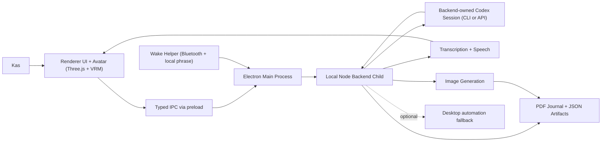

# Codex Avatar Architecture

## Notes

- The avatar is the primary front end.
- The visible Codex desktop app is optional review/debugging only.
- The wake helper is a separate local process, not part of the renderer loop.
- The same run result object drives speech, the PDF journal, and the generated image.
