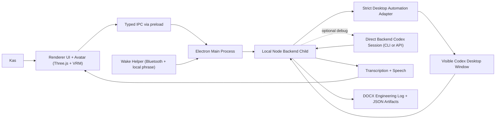

# Codex Avatar Architecture

## Notes

- The avatar is the primary front end.
- The visible Codex desktop app is the intended primary execution surface.
- Desktop automation is centralized into one strict adapter/service.
- Direct backend Codex execution is secondary/debug only.
- The wake helper is a separate local process, not part of the renderer loop.
- The same run result object drives speech, the DOCX engineering log, and the local diagram artifact.
